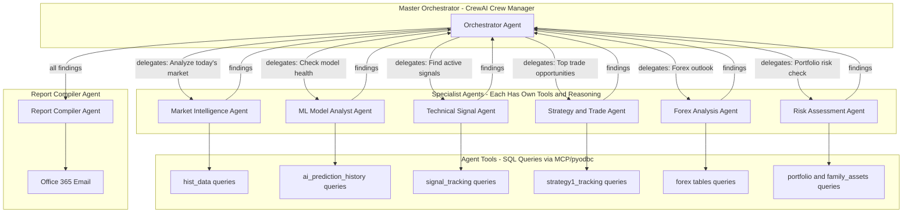
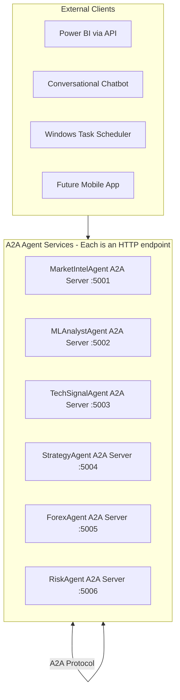

# Agentic AI Architecture for Stock Data Platform

## Framework Choice: CrewAI (with A2A Protocol for Inter-Agent Communication)

After evaluating LangGraph, CrewAI, and AutoGen, **CrewAI** is the best fit because:

- **Native MCP integration** -- you already have MCP SQL Server working in Cursor; CrewAI supports MCP servers as tools out of the box
- **Role-based agents** -- each agent has a role, goal, and backstory, mapping perfectly to your domain (Market Analyst, Risk Manager, etc.)
- **Built-in NL2SQL tool** -- for natural language to SQL conversion against your 29 tables
- **Anthropic Claude support** -- your chosen LLM provider
- **Official stock analysis example** -- CrewAI maintains a stock analysis sample in their repo
- **A2A compatibility** -- Google's A2A protocol has sample CrewAI agents, so your agents can be exposed as standalone services later

---

## True Multi-Agent Architecture

### How It Differs from a "Script with LLM"

A simple script: `Query DB -> Send to LLM -> Get summary -> Email`

A true agentic system: **Master Orchestrator delegates tasks to specialized agents, each with their own tools, memory, and reasoning. Agents can communicate with each other, share findings, and the orchestrator synthesizes everything.**



---

## The 6 Specialist Agents (Detail)

### Agent 1: Market Intelligence Agent

- **Role**: Senior Market Analyst
- **Goal**: Analyze latest price action, volume patterns, and market trends across NSE 500, NASDAQ 100
- **Tools**: SQL queries against `nasdaq_100_hist_data`, `nse_500_hist_data`, `nasdaq_100_fundamentals`, `nse_500_fundamentals`
- **Output**: Market summary -- which markets are trending up/down, unusual volume, notable movers

### Agent 2: ML Model Analyst Agent

- **Role**: Machine Learning Performance Analyst
- **Goal**: Evaluate accuracy of Linear Regression, Gradient Boosting, and Random Forest models
- **Tools**: SQL queries against `ai_prediction_history`, `ml_prediction_summary`, `ml_trading_predictions`
- **Output**: Model health scorecard -- which model is hot/cold this week, direction accuracy %, error trends
- **A2A Communication**: Can request data from Market Intelligence Agent to correlate model performance with market conditions

### Agent 3: Technical Signal Agent

- **Role**: Technical Analysis Specialist
- **Goal**: Identify active buy/sell signals and track historical signal outcomes
- **Tools**: SQL queries against `signal_tracking_history`, `ml_technical_indicators`, `daily_signals_history`
- **Output**: Active signals list with strength scores, 7d/14d/30d outcome tracking results

### Agent 4: Strategy and Trade Agent

- **Role**: Trading Strategy Manager
- **Goal**: Find the best trade opportunities by combining AI predictions with technical signals
- **Tools**: SQL queries against `strategy1_tracking`, `trade_log`, `prediction_watchlist`
- **Output**: Top 10 trade opportunities ranked by combined score, with tier classification, stop-loss/take-profit levels
- **A2A Communication**: Receives inputs from both ML Analyst and Technical Signal agents to cross-validate opportunities

### Agent 5: Forex Analysis Agent

- **Role**: Forex Market Specialist
- **Goal**: Analyze currency pair movements and ML predictions for forex
- **Tools**: SQL queries against `forex_hist_data`, `forex_ml_predictions`, `forex_daily_summary`, `forex_model_performance`
- **Output**: Forex outlook -- USD/INR trend, ML prediction signals, key levels

### Agent 6: Risk Assessment Agent

- **Role**: Risk Manager
- **Goal**: Evaluate portfolio risk, identify concentration issues, flag warnings
- **Tools**: SQL queries against `portfolio_tracker`, `family_assets`, `trading_alerts`
- **Output**: Risk report -- portfolio concentration, open trade exposure, warning flags from strategy tracking
- **A2A Communication**: Queries Strategy Agent for current exposure, Market Agent for volatility context

---

## Agent-to-Agent (A2A) Communication Patterns

### Pattern 1: Intra-Crew Communication (CrewAI Built-in)

Within a single CrewAI Crew, agents naturally share context through the task pipeline. The orchestrator defines a **sequential or hierarchical process**:

```mermaid
flowchart LR
    MarketIntel[Market Intel Agent] -->|"market context"| MLAnalyst[ML Analyst Agent]
    MLAnalyst -->|"model + market context"| TechSignal[Tech Signal Agent]
    TechSignal -->|"signals + model context"| StrategyTrade[Strategy Agent]
    StrategyTrade -->|"trades + all context"| RiskAgent[Risk Agent]
    RiskAgent -->|"final risk-adjusted view"| Compiler[Report Compiler]
```



Each agent's output becomes context for the next agent. The Strategy Agent doesn't just look at `strategy1_tracking` in isolation -- it has the Market Agent's trend analysis AND the ML Agent's model confidence data to make better assessments.

### Pattern 2: Agents as Tools (CrewAI Native)

Any agent can be registered as a **tool** for another agent. For example:

```python
# The Strategy Agent can "call" the ML Analyst as a tool
strategy_agent = Agent(
    role="Trading Strategy Manager",
    tools=[
        sql_query_tool,
        ml_analyst_agent_as_tool,      # Call ML Agent on-demand
        tech_signal_agent_as_tool,      # Call Tech Agent on-demand
    ]
)
```

This means the Strategy Agent can dynamically ask: "ML Analyst, what is the confidence breakdown for RELIANCE.NS?" and get a structured response -- true agent-to-agent delegation.

### Pattern 3: Google A2A Protocol (Phase 2 -- External Communication)

In Phase 2, each agent gets exposed as a standalone **A2A server** that any external system can call:



With A2A, your Power BI dashboard could call the Risk Agent directly, your chatbot could route questions to the right specialist agent, and agents can discover and communicate with each other using the standard A2A protocol.

---

## Project Structure

```
stockdata_agenticai/
    .env                          # Secrets (API keys, SMTP, SQL connection)
    .env.example                  # Template for secrets
    requirements.txt              # Dependencies
    README.md                     # Setup and usage guide
    config/
        settings.py               # Central configuration
        sql_queries.py            # All SQL query templates organized by agent
    tools/
        sql_tool.py               # pyodbc SQL Server tool (shared by all agents)
        email_tool.py             # Office 365 SMTP email tool
        calculation_tools.py      # Math/statistics helpers (accuracy %, P&L calc)
    agents/
        market_intel_agent.py     # Agent 1: Market Intelligence
        ml_analyst_agent.py       # Agent 2: ML Model Analyst
        tech_signal_agent.py      # Agent 3: Technical Signal Analyst
        strategy_trade_agent.py   # Agent 4: Strategy & Trade Manager
        forex_agent.py            # Agent 5: Forex Analysis
        risk_agent.py             # Agent 6: Risk Assessment
        report_compiler_agent.py  # Agent 7: Report Compiler
    crews/
        daily_briefing_crew.py    # Orchestrator: assembles agents into a Crew
    templates/
        briefing_email.html       # HTML email template
    main.py                       # Entry point
```

---

## Key Dependencies

- **crewai** + **crewai-tools** -- Multi-agent framework with tool support
- **anthropic** -- Claude LLM provider
- **pyodbc** -- SQL Server connectivity (your existing pattern)
- **python-a2a** (Phase 2) -- Google A2A protocol for exposing agents as services
- **python-dotenv** -- Environment variable management
- **jinja2** -- HTML email templating

---

## Implementation Phases

- **Phase 1 (This Week)**: Build the CrewAI multi-agent daily briefing system
  - 1A: Project setup, config, SQL tools, LLM provider
  - 1B: Build 6 specialist agents with their tools
  - 1C: Build orchestrator Crew with hierarchical delegation
  - 1D: Build report compiler agent + email delivery
  - 1E: Windows Task Scheduler automation
- **Phase 2 (Week 2)**: Expose agents via A2A protocol as HTTP services
- **Phase 3 (Week 3)**: Build conversational assistant that routes to specialist agents
- **Phase 4 (Week 4)**: Add Trade Journal and Model Monitor as new agents in the crew
- **Phase 5 (Month 2)**: Portfolio Risk agent + Backtesting agent
- **Phase 6 (Month 2-3)**: News Sentiment agent + enhanced A2A inter-agent workflows

---

## Key Benefit of This Architecture vs a Simple Script

- **Specialization**: Each agent reasons deeply about its domain, not a single LLM trying to do everything at once
- **Composability**: Add new agents (sentiment, backtesting) without rewriting anything -- just add to the Crew
- **Reusability**: The ML Analyst agent works in the daily briefing AND the conversational assistant AND the trade journal -- same agent, different crews
- **Scalability**: A2A protocol lets you expose any agent as an API endpoint for Power BI, mobile apps, or other systems
- **Agent Memory**: CrewAI supports agent memory -- over time, agents learn patterns from your data
- **Observability**: CrewAI provides built-in logging of agent reasoning chains, so you can see WHY the Strategy Agent recommended a particular trade

